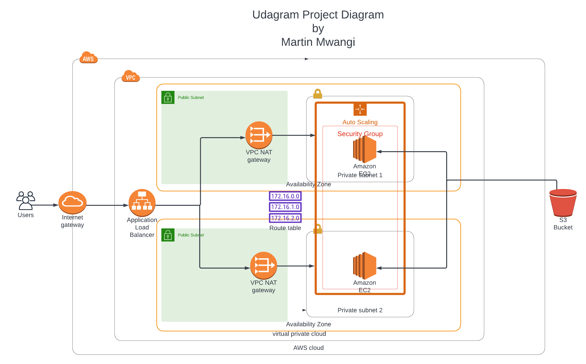

# Udacity cloud devops engineer nanodegree
## Project 2: Deploy a high-availability web app using CloudFormation
Load balancer dns name: http://udaci-WebAp-Z5T3NR9NAT1H-707569195.us-east-1.elb.amazonaws.com  
## Infrastructure diagram  

I created the ifrastructure diagram using lucidchart. 

To deploy the infructure to AWS use `./create.sh <stack-name> udagram-deploy-iac.yaml udagram-infra.json` at your own cost :)

## Useful links
[Udacity Cloud DevOps engineer](https://www.udacity.com/course/cloud-dev-ops-nanodegree--nd9991)  
[Lucidchart](lucid.app/)

## License

This project is licensed under the MIT Open Source license Copyright (c) 2022.